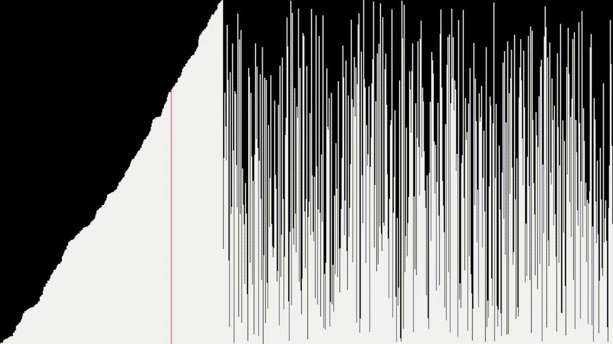

Simple sorting algorithm visualizer written in C and Raylib




dependencies
- some C compiler (like gcc)
- Raylib <a href="https://www.raylib.com/index.html">(link)</a>

to compile
```sh
make 
```
to just open
```sh
git clone https://github.com/Magdalen3/yet-another-sorting-algorithm
cd yet-another-sorting-algorithm
./executable
```
